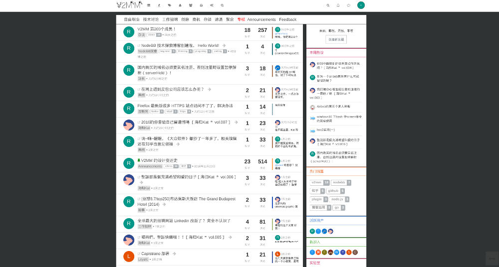
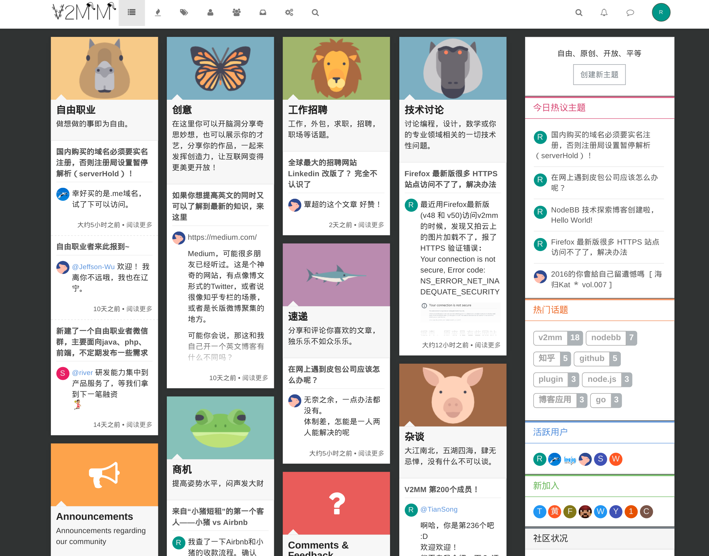

V2mm Theme for NodeBB
=========================

A nice theme used by [v2mm](http://v2mm.tech).
Please note, this theme is under actively development, some of the features may hard-coded in the sources, some of them may not work on your site.
This theme is for learning and playing NodeBB -- just for fun.

## Screenshots

**Home View**

**Category View**

**Custom Category**

## Unique Features

* external topics and comment, click to topic title, redirect to the external site;
* show subcategory topics on the root category;
* Custom category template, show author and comment directly on category. see: [Cross the GFW](https://v2mm.tech/category/40/collection-cross-gfw)

## Installation

    npm install nodebb-theme-v2mm

## Credits

Modified from "Lavender theme" by [psychobunny](https://github.com/NodeBB/nodebb-theme-lavender)
