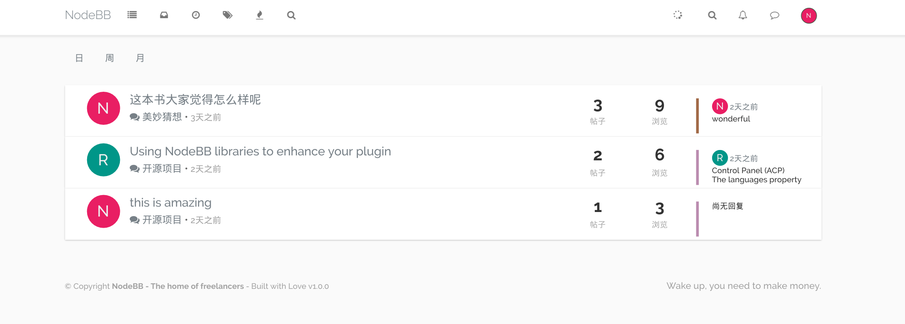
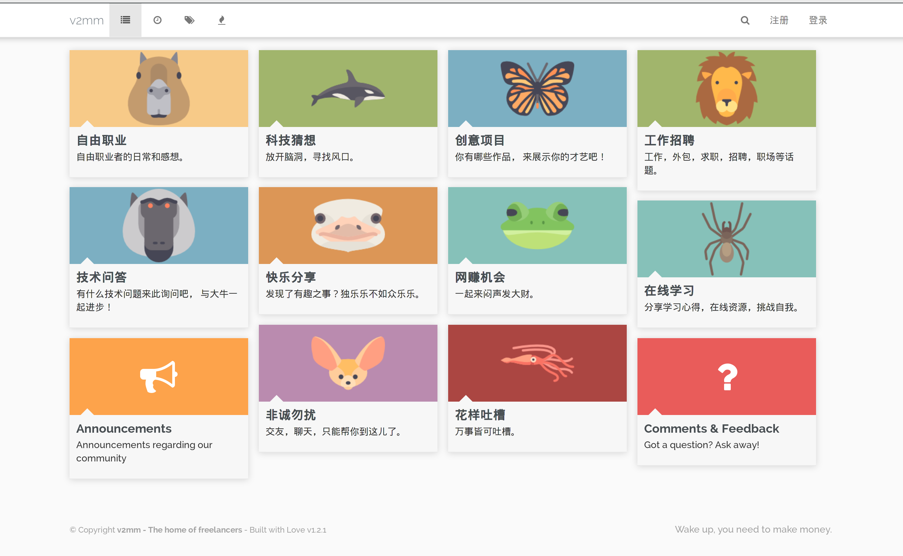

V2mm Theme for NodeBB
=========================

A simple theme based on lavender.

## Screenshots

**Home View**

**Category View**

## Installation

    npm install nodebb-theme-v2mm

## Credits

modified from "Lavender theme" by [psychobunny](https://github.com/NodeBB/nodebb-theme-lavender)
